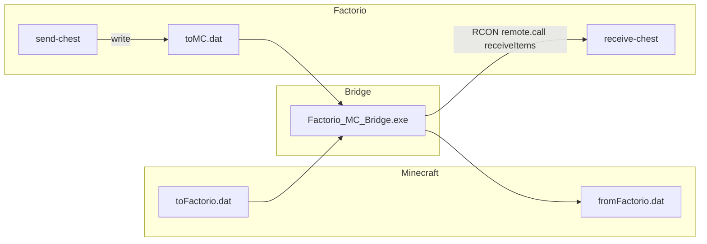

# Architecture

## Purpose

The project synchronizes **item stacks** between a Factorio game (or dedicated server) and a Minecraft world. It is not a full game link: it focuses on **named items and counts** (with optional ratio mapping), not entities, fluids, or power in the shipping path—though experimental code in `FMC_Bridge_Core` references fluids and energy for future work.

## Major components

### 1. Factorio mod (`Factorio/transfer-chest_2.0.0`)

- Defines **`send-chest`** (one slot) and **`receive-chest`** (larger inventory).
- On a fixed tick interval, reads **send** chests and writes `script-output/toMC.dat` via `helpers.write_file`.
- Registers a **`receiveItems`** remote interface so external RCON can call `inputItems(itemName, count)` and insert into a **receive** chest.

### 2. Bridge application (C#)

Two solution layouts exist:

| Location | Role |
|----------|------|
| `Bridge/Factorio_MC_Bridge/Factorio_MC_Bridge` | **Primary documented path**: polls Factorio’s `toMC.dat`, sends Minecraft-bound items using RCON; reads/writes Minecraft bridge files `toFactorio.dat` / `fromFactorio.dat` next to the configured Minecraft server folder. |
| `Bridge/FMC_Bridge_Core/Factorio_MC_Bridge` | **Experimental**: TCP listener for Minecraft-style JSON, separate RCON thread, commented-out legacy file loop; useful for development but not the same entry point as the simple console bridge. |

### 3. Minecraft mod `FMCBridge` (`FMCBridge/`)

- Forge mod for **1.12.2** adding **TCS** (sender) and **TCR** (receiver) blocks with tile entities.
- On world load, attempts a **TCP client** to `127.0.0.1:25575` and authenticates with credentials from **`fmcbridge.cfg`** (`Config.java`).
- **Sender manager** tile aggregates items from all TCS blocks and pushes JSON to the bridge over the socket; **receiver manager** requests inbound items and distributes them to TCR inventories (with optional per-chest item locks).

## Logical data flows

### Classic file-based loop (matches `Bridge/Factorio_MC_Bridge` + Factorio `control.lua`)

- **Factorio → Minecraft**: `toMC.dat` → bridge → `fromFactorio.dat` (after name mapping).
- **Minecraft → Factorio**: `toFactorio.dat` → bridge → RCON → `receiveItems.inputItems`.

### Socket path (Minecraft mod ↔ bridge experiment)

The Minecraft mod expects a **server process** listening on **port 25575** that speaks the login + framed JSON protocol described in [Data formats and protocols](data-formats-and-protocols.md). The stock `Factorio_MC_Bridge` **file-based** `Program.cs` does **not** implement that listener; `FMC_Bridge_Core` contains a partial TCP implementation that may not match the Java client’s framing byte-for-byte. Treat socket mode as **integration under development** unless you verify both sides against a packet capture or shared test.

## Manager pattern (Minecraft mod)

- The **first** placed **TCS** becomes the **send manager**; it ticks every second (`ticks % 20 == 0`) and drains all registered TCS inventories into the bridge output queue.
- The **first** **TCR** becomes the **receive manager**; it signals the input thread to pull JSON lists and calls `receive()` to insert into chests (respecting locks and free slots).

If the manager is removed, another entity in the map is promoted.

## Design constraints

- **Single-slot send** on Factorio side per chest tick aggregation in `control.lua` (one line per non-empty send chest per write batch behavior—see Factorio mod doc).
- **RCON** must be enabled on the Factorio server for the classic bridge.
- **Paths** in `settings.json` must point at the Factorio **user data** / script-output root and the Minecraft server directory used for the dat files (see [Setup and configuration](setup-and-configuration.md)).
